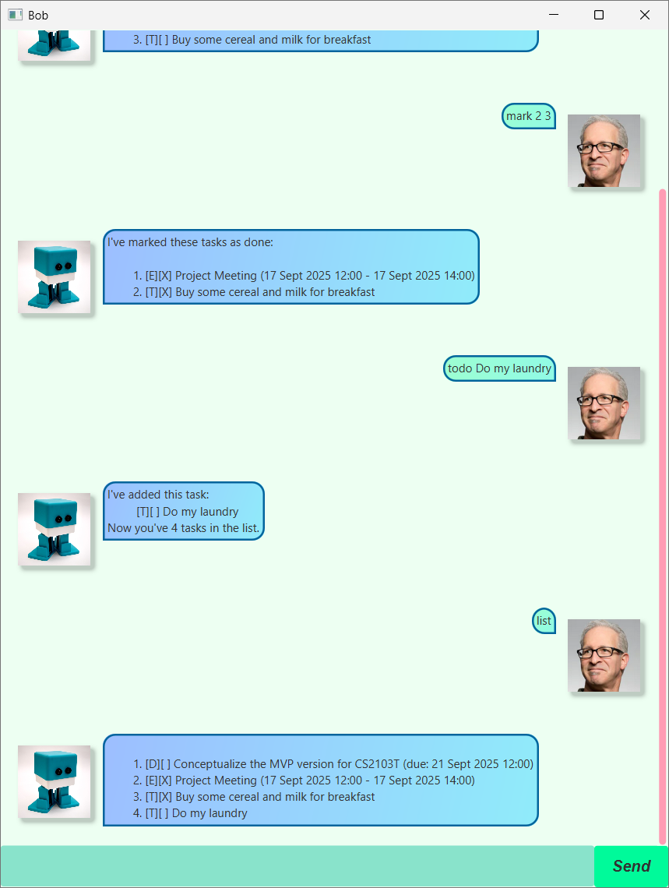

# Bob User Guide

# Bob, building a better you

> "With **Bob**, I have _never forgotten an event, task, or todo._" - A satisfied user 😄 

Use Bob to manage your event, task and todo all in one place, without leaving the keyboard.

## Summary of the commands available

Bob allows you to perform this actions via **text commands**:

* `list` - List all tasks
* `mark <task number>` - Mark a task as done
* `unmark <task number>` - Unmark a task as not done
* `todo <description>` - Add a task without any date/time attached to it
* `deadline <description> /by <datetime>` - Add a task that need to be done before a specific date/time
* `event <description> /from <start datetime> /to <end datetime>` - Add task that start at a specific date/time and ends at a specific date/time
* `delete <task number>` - Delete a task from the list
* `find <search keyword>` - Search for a task that contains <search keyword> in the description.
* `bye` - Exit the program

## How to get it

1. Ensure you have java installed.
1. Download the jar [here](https://github.com/pohanson/ip/releases/download/A-Release/Bob.jar)
1. `java -jar <filename>` to run the file.
1. Just use it.
